# 🧪 Proyecto churn de servicios del banco

## ❓ Planteamiento del proyecto
En un mundo en donde los dineros se trabajan mediante sistemas bancarios es natural que cada vez existan más organismos de este estilo, generando una gran competencia en donde los clientes tienen distintas opciones a elegir, por lo que es de gran importancia tener en claro cuales son los indicadores más claros que hacen de un cliente fiel al organismo bancario. Este proyecto se ha desarrollado con la intención de realizar un análisis sobre un dataset con datos bancarios de distintos usuarios, de los cuales, algunos han optado por retirarse y dejar de utilizar los productos del banco en cuestion. Con respecto a ello, es necesario identificar características que más influyen en la posibilidad de abandono de este caso. Además de generar modelos de Machine Learning capaces de predecir cuales son los clientes que potencialmente pueden realizar el abandono.

## ℹ️ Dataset
Recurso: Kaggle

Registros: 10000

## 🎯 Objetivo
- Encontrar features con más impacto en el abandono (Exited)
- Generar modelos capaces de identificar cliente potenciales de abandono

## 🧹 Data cleaning
En este dataset en concreto se ha revisado la existencia de datos nulos o textos vacíos, pero no se ha encontrado nada, se considera un dataset limpio.

## 📈 EDA
Insights:

- Este dataset tiene un desbalance importante en el target (Exited), por lo que en el trabajo de ML será necesario ajustar pesos de clases

- El CreditScore no es un buen indicador, aunque si se puede ver que los clientes que se van tienen un CreditScore parcialmente más bajo.

- La mayor cantidad de clientes del banco son franceses, mientras que en Germany y Spain existe una cantidad muy similar.

- Germany es el país con más churn de los 3 en relación de su cantidad de clientes.

- La mayor cantidad de clientes que han pasado por el banco son personas adultas entre los 35 a 40 años.

- Se han separado por grupos etarios los clientes, a lo cual se ha llegado a la conclusión de que los clientes con un abandono notorio son los que tienen entre 45 y 60 años.
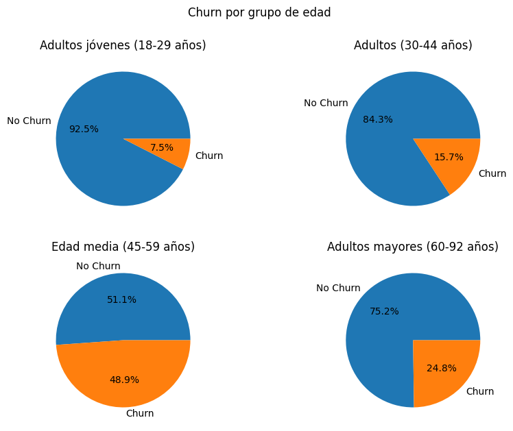

- El tenure no es un buen indicador de Exited, aunque de todas formas, dentro de los clientes que se han ido, lo datos son un poco más variados.
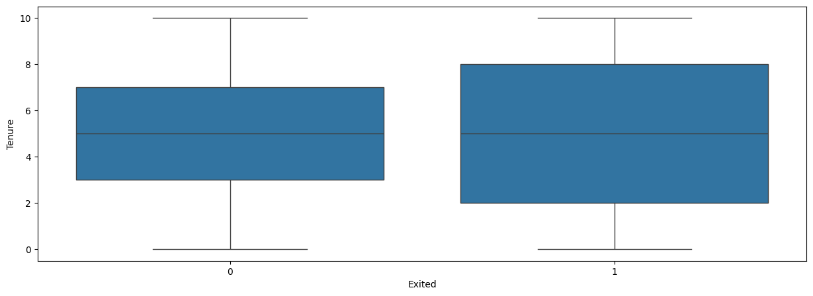

- Dentro de este dataset casi todos los clientes tienen un Balance de 0, aunque existe una tendencia de tener un Balance de al rededor de los 125000
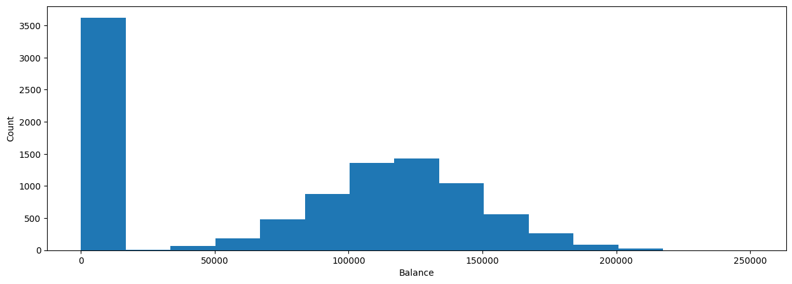

- Dentro de los clientes que se quedan en el banco, es más común que tengan un balance de 0, mientras que los clientes que se van suelen tener un balance de al rededor de 120000.
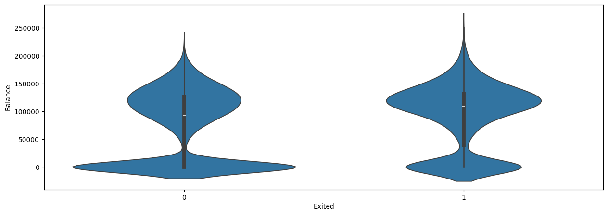

- Los que tienen balance se tienden a ir un 10% más que los que no lo tienen.
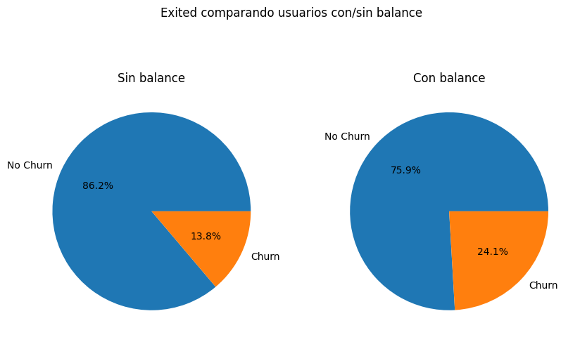

- La mejor cantidad de productos que debería tener un cliente, es de 2, ya que con esta cantidad es mucho menos probable que abandone el banco. Además, las peores cantidades de productos son 3 y 4.
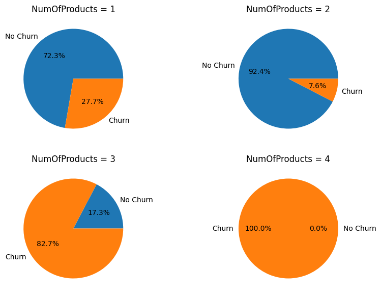

- No tiene relevancia tener o no tener tarjeta del banco.
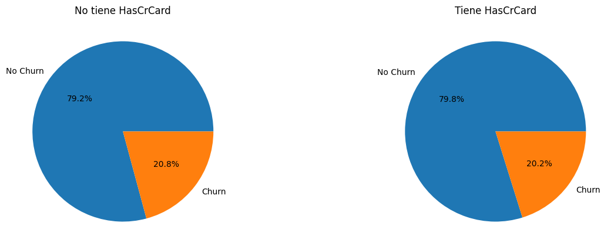

- Los miembros no activos tienden a irse de manera más frecuente.
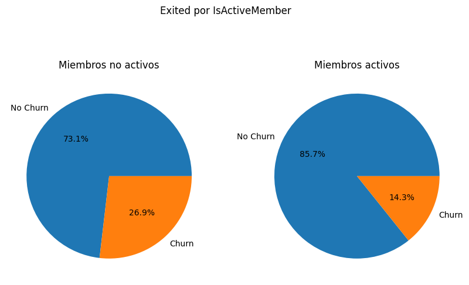

- El salario estimado no tiene mucha incidencia dentro del abandono.
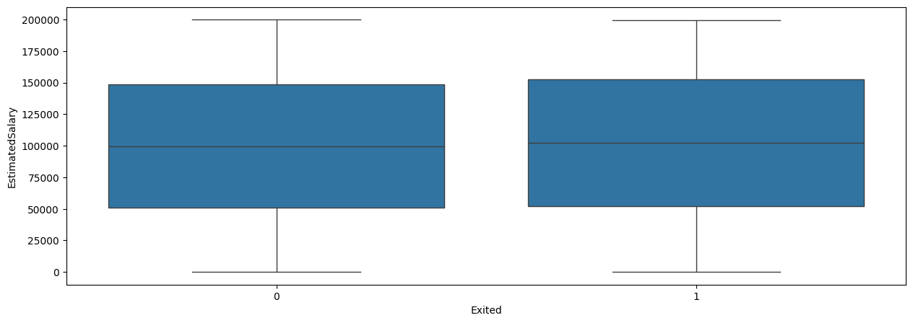

## ⚙️ Feature engineering
- AgeGroup:
Separación de grupos etarios con el fin de proporcionar mejor visión y segmentación, utilizando 4 grupos separados entre 18/29, 30/44, 45/59 y 60 hacia adelante. Obtiendo grupos de adultos jóvenes, adultos, mediana edad y senior.
Gráfico base de esta decisión:

- HasBalance:
Identifica de forma binaria si el cliente tiene balance =0 o >0.
Gráfico base de esta decisión:

- Age_x_NumOfProducts_score:
Genera un puntaje relacionando el grupo al que pertenece y su cantidad de productos. Es el producto de la multiplicación de valores no lineales, por lo que se han estimado valores diferentes para cada grupo y cada cantidad de productos.
Gráficos base de esta decisión:

- BalanceAndActive:
Puntaje indicador de que tanto el cliente utiliza el banco y si tiene balance además de ser activo.
Gráficos base de esta decisión:

- Score_AgeAndSalaryScore:
Puntaje que sectoriza e identifica potencial financiero, diviendo el salario estimado por la edad.
Gráficos base de esta decisión:

## 🤖 ML
Modelos utilizados:
- LogisticRegression
- RandomForestClassifier

Se han realizado 2 versiónes para cada modelo, por lo cuál se presentarán cada uno por separado.

### Modelo LogisticRegression
#### V1
Modelo de forma estándar y sin tuning. Se entiende que por un importante desbalanceo de clases, el modelo tiende a predecir que los usuarios no se irán, siendo un modelo muy conservador y que no atiende a las necesidades de la empresa. Debido a que el mayor objetivo es detectar quien abandona, no quien se queda.

Métricas:
Accuracy LogisticRegression_v1: 0.8485
Precision LogisticRegression_v1: 0.6844262295081968
F1 LogisticRegression_v1: 0.5243328100470958
Recall LogisticRegression_v1: 0.42493638676844786
Roc Auc LogisticRegression_v1: 0.688510508256657

Matriz de confusión:
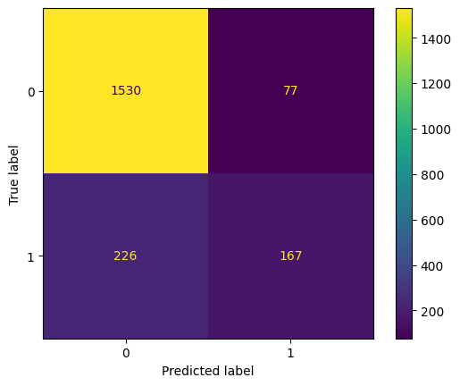

#### V2
Utilizando tuning como lo es el aumento de iteraciones y balanceo de clases, se obtiene un modelo bastante mejor, capaz de encontrar más posibles clientes con potencial de abandono, aunque permite un número ligeramente considerable de falsos positivos.

Métricas:
Accuracy LogisticRegression_v2: 0.7485
Precision LogisticRegression_v2: 0.42445054945054944
F1 LogisticRegression_v2: 0.5512934879571811
Recall LogisticRegression_v2: 0.7862595419847328
Roc Auc LogisticRegression_v2: 0.7627626272462557

Matriz de confusión:
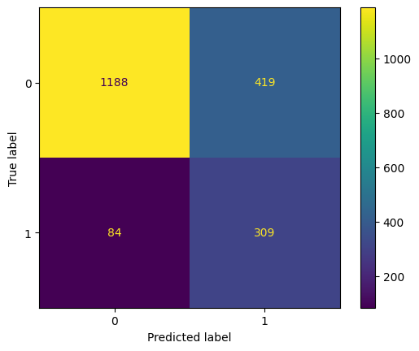

### Modelo RandomForestClassifier
#### V1
Modelo de forma estándar y sin tuning. Debido al desbalanceo, identifica casi al 50% de los clientes que efectivamente se van, aunque obtiene mejores capacidades iniciales que LogisticRegression siguen siendo insuficientes.

Métricas:
Accuracy RandomForestClassifier_v1: 0.8635
Precision RandomForestClassifier_v1: 0.75
F1 RandomForestClassifier_v1: 0.5687203791469194
Recall RandomForestClassifier_v1: 0.4580152671755725
Roc Auc RandomForestClassifier_v1: 0.7103393075143576

Matriz de confusión:
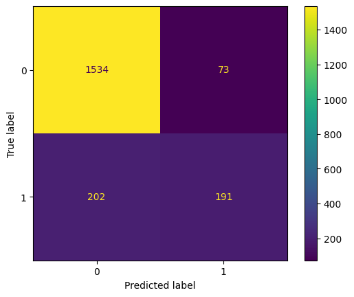

#### V2
Utilizando tuning, como lo es el aumento de n_estimators, balanceo de clases, etc. Se ha alcanzado un rendimiento superior considerando la cantidad de clientes identificados que se van, sin dar una cantidad muy comprometida de falsos positivos. Considerado como el mejor modelo en este ejercicio debido a su alineamiento con la intención final prioritaria de identificar a los clientes que se van.

Métricas:
Accuracy RandomForestClassifier_v2: 0.801
Precision RandomForestClassifier_v2: 0.49592169657422513
F1 RandomForestClassifier_v2: 0.6043737574552683
Recall RandomForestClassifier_v2: 0.7735368956743003
Roc Auc RandomForestClassifier_v2: 0.7906265685589922

Matriz de confusión:
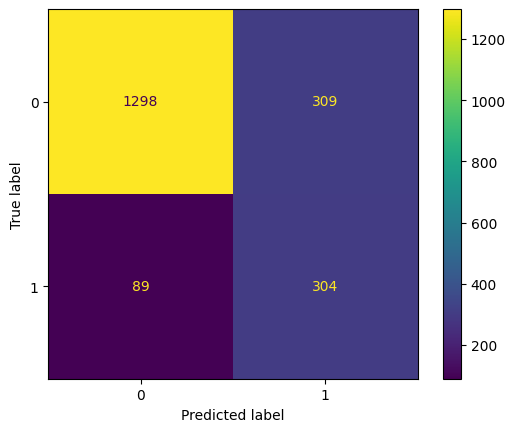

## 🏆 Conclusiones finales y recomendaciones
Los modelos generados de Machine Learning se considera que cumplen con los requisitos de la empresa, teniendo la capacidad de identificar en su gran mayoría a los clientes que potencialmente puedan abandonar los servicios, sobre todo en el modelo de RandomForestClassifier con su segunda versión la cual sigue teniendo muy buenas capacidades de detectar a los clientes que no son potenciales abandonadores.

El análisis de los datos a traves de EDA permite identificar características que son más comunes en clientes que se van, además de brindar la posibilidad de generar las siguientes recomendaciones:

1. Realizar campañas para obtener nuevos clientes principalmente en los países de Germany y Spain.

2. Ofrecer importantes beneficios e incentivos para quedarse en el banco a los grupos etarios entre 45 y 59, siendo esta recomendación especialmente importante.

3. Realizar una revisión de todos los clientes con 2 productos, identificar que productos son e incitar a los clientes a obtener esos 2 productos, dejando de lado la obtención de más. Debido a la alta tasa de abandono en 1, 3 y 4 productos.

4. Realizar recordatorios a los clientes, que los ayude a ser más activos dentro del banco.

Para terminar, se concluye que el análisis y trabajo generado en este dataset permite identificar las mayores características de los clientes que abandonan los servicios, obteniendo además un modelo de ML efectivo, ayudando de gran manera en la misión de fidelizar a los clientes.

## Versión de python para el kernel
- Python 3.11.9

## Autor
Carlos Rojas Villegas

